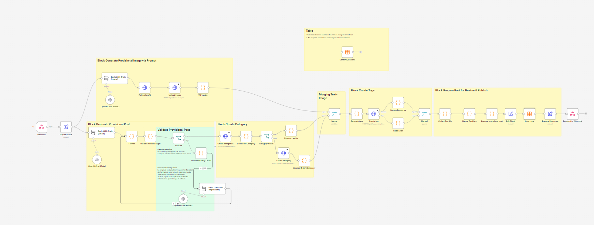
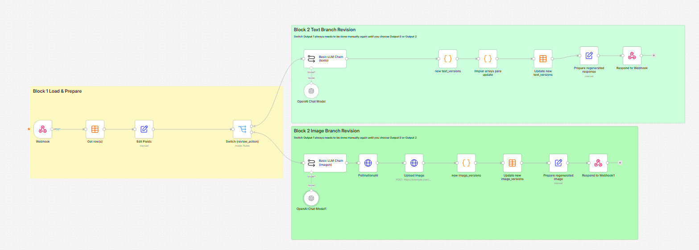
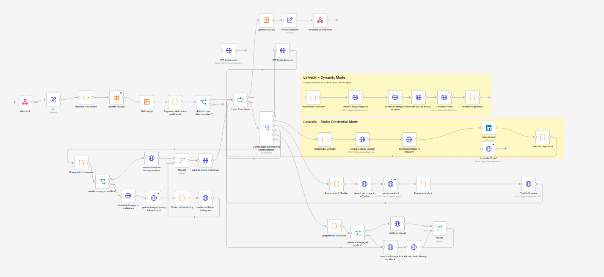

# n8n Social Media Automation

A modular automation system built with n8n that manages the complete lifecycle of AI-generated content, from generation and review to multi-platform publication.

The workflows are designed to integrate with a custom web application through webhooks and can be adapted to different publishing environments.

---

# Project Context

These workflows are not intended to be used as standalone automations.

They were designed as the backend automation layer of a custom web application where users can generate, review, and publish AI-powered content through a graphical interface.

The web application collects all publication settings, such as:

- Language
- Tone
- Target audience
- Platform-specific options
- SEO information
- Image preferences

and sends them to the appropriate workflow through webhooks.

The automation then:

- Generates AI-powered content.
- Generates AI images.
- Uploads the generated image to the WordPress Media Library.
- Uses the uploaded WordPress media as the canonical image for every supported social media platform.
- Creates platform-specific content.
- Stores review sessions inside n8n Data Tables.
- Allows regenerating text or images before publication.
- Publishes approved content (Workflow 3).

This architecture avoids generating duplicate images for every platform while ensuring that every social network references the same media asset.

The frontend application is developed separately and communicates with these workflows through webhooks.

---

# Current Workflows

## Workflow 1 — Content Generation

Responsible for generating complete multi-platform content.

Main responsibilities:

- Generate AI content
- Generate AI image
- Upload image to WordPress
- Generate platform-specific versions
- Store draft into Data Table
- Create review session

File:

```
workflow-1-content-generation.json
```

---

## Workflow 2 — Review & Regeneration

Loads a previously generated draft and allows regenerating either the text or the image while preserving version history.

Main responsibilities:

- Load review session
- Regenerate article
- Regenerate image
- Preserve previous versions
- Update Data Table
- Return updated content

File:

```
workflow-2-review-regeneration.json
```

---

## Workflow 3 — Publishing & Distribution

Responsible for publishing approved content to multiple platforms.

Main responsibilities:

- Publish to WordPress
- Publish to LinkedIn
- Publish to X (Twitter)
- Publish to Facebook
- Publish to Instagram
- Dynamic credential support
- Multi-platform routing
- Update publication session
- Return webhook response

File:

```
workflow-3-publishing-distribution.json
```

---

# Overall Architecture

```text
                 Custom Web Application
                           │
                    POST / Webhook
                           │
                           ▼
                 Workflow 1
          AI Content Generation
                           │
                           ▼
              Review Session Stored
                           │
                           ▼
                 Workflow 2
         Review & Regeneration
                           │
                           ▼
                Approved Draft
                           │
                           ▼
                 Workflow 3
        Publishing & Distribution
                           │
        ┌────────┬────────┬────────┬────────┐
        ▼        ▼        ▼        ▼        ▼
    WordPress LinkedIn    X    Facebook Instagram
```

---

# Technologies

## Automation

- n8n
- Webhooks
- n8n Data Tables

## Artificial Intelligence

- OpenAI
- Pollinations AI

## APIs & Integrations

- WordPress REST API
- LinkedIn API
- X (Twitter) API
- Facebook Graph API
- Instagram Graph API
- Cloudinary API

## Development

- JavaScript (Code Nodes)
- JSON
- HTTP Requests
- OAuth 2.0
- Basic Authentication

---

# Concepts Demonstrated

- Workflow Orchestration
- Multi-platform Content Distribution
- AI Content Generation
- AI Image Generation
- Dynamic Credential Handling
- Content Review & Regeneration
- Version History
- Modular Workflow Design
- API Integration
- Error Handling

---

# Required Configuration

Before running the workflows configure:

## OpenAI

Create your own OpenAI credentials and assign them to every Chat Model node.

## WordPress

Replace the placeholder endpoints:

```
https://example.com/wp-json/...
```

with your own WordPress REST API endpoints.

Configure authentication for every WordPress node.

## Data Tables

Create a Data Table named:

```
content_sessions
```

and select it inside the required Data Table nodes.

---

# Repository Structure

```text
n8n-social-media-automation/

├── README.md
├── workflow-1-content-generation.json
├── workflow-2-review-regeneration.json
├── workflow-3-publishing-distribution.json
├── screenshots/
│   ├── workflow-1-content-generation.png
│   ├── workflow-2-review-regeneration.png
│   └── workflow-3-publishing-distribution.png
└── docs/
```

---

# Screenshots

## Workflow 1 – Content Generation



## Workflow 2 – Review & Regeneration



## Workflow 3 – Publishing & Distribution



# Workflow Dependencies

The workflows are designed to work together.

Workflow 1 creates the review session.

Workflow 2 loads that session and allows regenerating text or images while preserving version history.

Workflow 3 receives the approved draft and publishes it to the configured platforms while updating the publication session.

---

# System Design

The workflows are intentionally separated into independent modules.

This architecture provides several advantages:

- Easier maintenance
- Better scalability
- Independent testing
- Clear separation of responsibilities
- Reusable automation components

The custom frontend orchestrates the complete process by communicating with each workflow through dedicated webhooks.

---

# Roadmap

## Completed

- Workflow 1 — AI Content Generation
- Workflow 2 — Review & Regeneration
- Workflow 3 — Publishing & Distribution

## Planned Improvements

- Additional social media connectors
- Improved error handling
- OAuth setup wizard
- Enhanced logging and monitoring

---

# Notes

These workflows are provided as reusable templates.

Before running them you must configure:

- OpenAI credentials
- WordPress credentials
- Webhook URLs
- Data Tables
- Environment-specific settings

---

# License

MIT

---

If you have any questions or suggestions, feel free to open an issue or contribute to the project.
